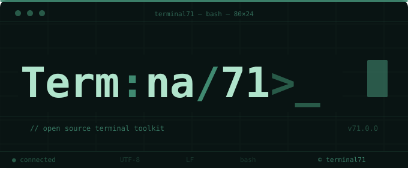

  

> Software Solutions Company

## Description

Terminal 71 is a software solutions company focused on building modern, scalable, and efficient web applications for clients. We transform ideas into digital solutions through clean design, structured development, and collaborative teamwork.

Our team is composed of passionate developers, project managers, and marketers dedicated to creating high-quality systems that help businesses and organizations grow in the digital space.

---

# About Us

Terminal 71 started as a group of organized developers with a shared passion for technology, innovation, and problem-solving. What began as collaborative freelancing evolved into a structured software solutions company with dedicated leadership and development workflows.

We believe software should not only function properly but also provide meaningful experiences, performance, and long-term scalability.

Our mission is to:
- Build reliable and modern web applications
- Help clients bring their ideas to life
- Maintain clean and scalable development practices
- Deliver professional and user-focused solutions

---

# What We Do

Currently, Terminal 71 offers:

- Custom Web Application Development
- Backend API Development
- Modern UI/UX Interfaces
- Admin & Management Dashboards
- Secure Web Systems
- Deployment & Maintenance

---

# Our Projects

| Project Name | Description |
|---|---|
| [Project Test](https://github.com/your-org/project-alpha) | TEMPORARY |

---

# Founders

| Role | Name | GitHub |
|---|---|---|
| CEO | Mark Andrew Aquino | https://github.com/aquinomark217 |
| CTO | Rafael Luis Oli | https://github.com/IzanamiiDevv |
| Project Manager | Krey Francisco |
| Lead Marketing | Dexter Paniza |

---

# Contact

## Business Email
terminal71corp@gmail.com

## Website
https://terminal71.com

---

<h3 align="left">Langauge and Frameworks:</h3>

###

  
  
  
  
  
  
  
  
  
  
  
  
  
  
  
  
  
  
  
  
  
  
  
  
  
  
  
  
  
  
  
  
  
  
  
  
  
  
  
  
  
  
  
  
  

<h3 align="left">Tools:</h3>

###

  
  
  
  
  
  
  
  
  
  
  
  
  
  
  
  
  
  
  
  
  
  
  
  
  
  
  
  
  
  
  
  
  
  
  
  
  
  
  
  
  

###

###

---

# Vision

Our vision is to grow Terminal 71 into a trusted software solutions company recognized for innovation, reliability, and impactful digital experiences.

---

# License

This repository and its contents are owned and maintained by Terminal 71.
Unauthorized distribution or resale of proprietary projects is prohibited.
